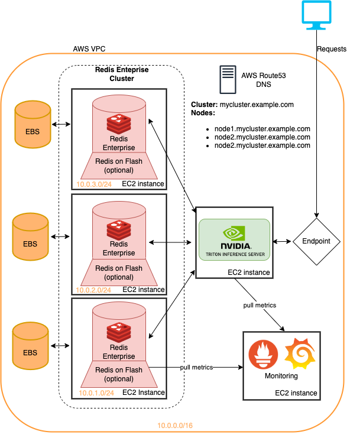

# Recommendation Systems with NVIDIA Merlin and Redis

This repository holds the assets that supplement the article "Offline to Online: Feature Storage for Real-time Recommendation Systems with NVIDIA Merlin" written originally for the NVIDIA Developer Blog.

## Recommendation System Architectures

We provide examples of recommendation system architectures and provide cloud deployment instructions for production usage. Each of the examples rely on Redis and the NVIDIA Merlin framework which provides a number of building blocks for creating recommendation systems.

There are 3 examples within this repository
1. [Offline Batch Recommendations](./offline-batch-recsys/)
2. [Online Recommendation Systems](./multi-stage/)
3. [Large-Scale Recommender Models with HugeCTR](./large-scale-recsys/)

The Large-Scale expands on the second architecture for use cases that demand large
scale (> 1 GPU) training or inference.

Each of the examples are designed to run locally on a NVIDIA GPU enabled system with
docker and docker-compose. We recommend executing all of the following on a cloud instance with an NVIDIA GPU (ideally the AWS Pytorch AMI)

However, we also provide a set of terraform scripts and ansible notebooks that can deploy the infrastructure necessary to execute the examples on AWS instances.

### [1. Offline Batch Recommendations](./offline-batch-recsys/)


"Offline" recommendation systems use batch computing to process large quantities of data and then store them for later retrieval. The diagram above shows an example of such a system that uses a Two-Tower approach to generate recommendations and then stores them inside a Redis database for later retrieval.

The [offline notebook](./offline-batch-recsys/Offline-Batch-Recommender-System.ipynb) provides methods to build up
this type of recommendation system as well as trains and exports the models necessary for running the online
recommendation system in the following section.


To execute the notebook, run the following

```bash
$ docker compose up # -d to daemonize
```

Then open the link generated by Jupyter in a browser.

### [2. Online Recommendation Systems](./multi-stage/)


An "online" recommendation system generates recommendations on-demand. As opposed to batch oriented systems, online systems are latency-constrained. When designing these systems, the amount of time to produce recommendations is likely the most important factor.   Commonly capped around 100-300ms, each portion of the system needs components that are not only efficient but scalable to millions of users and items. Creating an online recommendation system has significantly more constraints than batch systems, however, the result is often better recommendations as information (features) can be updated in real-time. The diagram above shows an example of this architecture.

The previous example for batch recommendations generates the models and datasets for this notebook, but you can also just download pre-trained assets with the AWS CLI as follows

```
aws s3 cp s3://redisventures/merlin/merlin-recsys-data.zip ./data
```

To execute the notebook, run the following

```bash
$ docker compose up # -d to daemonize
```

This section contains two notebooks: one for deploying the feature store (Redis) and creating
the vector index (Redis) and another for defining and running the ensemble model to run the
entire pipeline (Triton).

> Note: Be sure to run the first notebook prior to the second or the model will not execute.

### [3. Large-Scale Recommender Models with HugeCTR](./large-scale-recsys/)


The last notebook that shows how to handle very large datasets when training models like DLRM for recommendation systems. Large enterprises often have millions of users and items. The entire embedding table of a model may not fit on a single GPU. For this, NVIDIA created the HugeCTR framework.

HugeCTR is a part of a NVIDIA Merlin framework and adds facilities for distributed training and serving of recommendation models. The notebook detailed here focuses on the deployment and serving of HugeCTR and provides a pre-trained version of DLRM that can be used for the example. More information on distributed training with HugeCTR can be found here.

To execute the local notebook, run the following

```bash
$ docker compose up # -d to daemonize
```

### [4. Cloud Deployment](./cloud-deployment)

This folder includes terraform scripts and ansible playbooks that deploy

- Redis Enterprise Software
- GPU instances for Triton inference serving
- Grafana and Prometheus instance for monitoring
- A VPN
- DNS records

All on Amazon Web Services.



The examples presented in this repository can all be run on the terraformed infrastructure
with minimal changes. This is a quick method to deploy this infrastructure to try out
the Recommendation System pipelines detailed here. See the README within the
[cloud-deployment](./cloud-deployment) for more.


## Resources

### Pre-trained Models

The models in this tutorial can be retrieved with the aws cli by running

```
aws s3 cp s3://redisventures/merlin/merlin-recsys-data.zip ./data
```

### Repositories

The following repostories link to code/assets used in articles and notebooks

- [Redis Ventures](https://github.com/RedisVentures)
- [Feast GitHub](https://github.com/feast-dev/feast)
- [NVTabular](https://github.com/NVIDIA-Merlin/NVTabular)
- [HugeCTR](https://github.com/NVIDIA-Merlin/HugeCTR)
- [Merlin Models](https://github.com/NVIDIA-Merlin/models)
- [Merlin Systems](https://github.com/NVIDIA-Merlin/systems)
- [Transformers4Rec](https://github.com/NVIDIA-Merlin/Transformers4Rec)

### Inspirational Notebooks

The notebooks here build on the work of many pre-existing notebooks such as

- [HugeCTR Backend examples](https://github.com/triton-inference-server/hugectr_backend/tree/main/samples)
- [HugeCTR examples](https://github.com/NVIDIA-Merlin/HugeCTR/tree/main/samples)
- [Merlin Examples](https://github.com/NVIDIA-Merlin/Merlin/tree/main/examples)
- [Deploying Multi-Stage Recsys](https://github.com/NVIDIA-Merlin/Merlin/tree/main/examples/Building-and-deploying-multi-stage-RecSys)


### Articles and other Recommended Reading

We highly recommend reading

- [Designing Machine Learning Systems](https://www.amazon.com/Designing-Machine-Learning-Systems-Production-Ready/dp/1098107969/ref=asc_df_1098107969/?tag=hyprod-20&linkCode=df0&hvadid=564675582183&hvpos=&hvnetw=g&hvrand=6460096250567075707&hvpone=&hvptwo=&hvqmt=&hvdev=c&hvdvcmdl=&hvlocint=&hvlocphy=1027270&hvtargid=pla-1688018801992&psc=1)
- [DLRM article](https://ai.facebook.com/blog/dlrm-an-advanced-open-source-deep-learning-recommendation-model/)
- [Merlin HPS](https://developer.nvidia.com/blog/scaling-recommendation-system-inference-with-merlin-hierarchical-parameter-server/)
- [Moving Beyond Recommender Models Talk](https://www.youtube.com/watch?v=5qjiY-kLwFY&list=PL65MqKWg6XcrdN4TJV0K1PdLhF_Uq-b43&index=9)
- [WDL Notes](https://calvinfeng.gitbook.io/machine-learning-notebook/supervised-learning/recommender/wide_and_deep_learning_for_recommender_systems)
- [How to build a DLRM](https://developer.nvidia.com/blog/how-to-build-a-winning-recommendation-system-part-2-deep-learning-for-recommender-systems/)
- [Monolith Paper](https://arxiv.org/abs/2209.07663)
