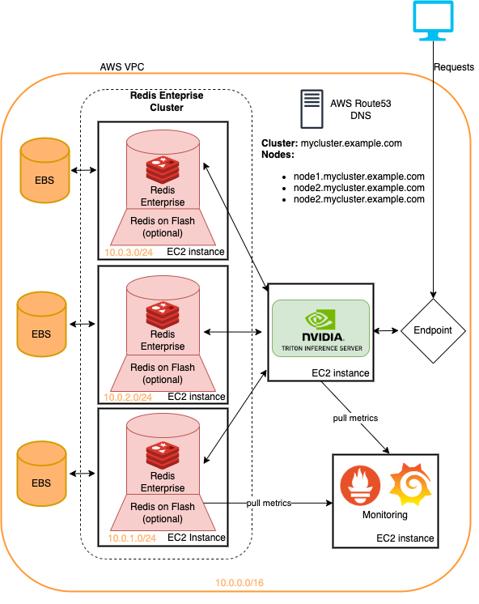

# Cloud Deployment

The recommendation systems presented in this repository use local docker-compose to provide easy-to-run examples. However, examples like this are not directly impactful as there are
still many tools, libraries, and services that need to be included around the examples in
order to be put into production.

While this is not everything one would need, the code within this folder represents a good
headstart into using Redis Enterprise, a production-ready version of Redis, for the recommendation system examples found in this repository.



This folder includes terraform scripts and ansible playbooks that deploy

- Redis Enterprise Software
- GPU instances for Triton inference serving
- Grafana and Prometheus instance for monitoring
- A VPN
- DNS records

All on Amazon Web Services.

## Requirements

Before running you will need the following

- R53 DNS_hosted_zone_id (from a domain name)
- AWS access key and secret key
- AWS SSH key for this region (``my_key.pem``)

As well as the following installed on your system

- AWS-cli
- terraform (install through system package manager i.e. brew)
- ansible (install with pip in virtual environment)

For more detailed instructions on setting up the requirements please see [this repo](https://github.com/Redislabs-Solution-Architects/tfmodule-aws-redis-enterprise-deploy-cluster) from
which this folders contents was forked and contains much more information about the ansible
and terraform code.

## Deployment

1. Confirm requirements are met

```bash
aws configure # setup aws keys
ansible --version
terraform --version
```

2. Fill in the terraform values that require user input

```
cp terraform.tfvars.example terraform.tfvars
```

Fill out ``terraform.tfvars`` specifically pay attention to
- AWS information
    - keys (access, secret and ssh)
    - dns hosted zone
    - region
- Triton instance settings
    - instance type
    - ami (``ami-0b61d2979f583d63d`` for ubuntu 20 Pytorch AMI)
- Redis Enterprise settings
    - Download URL
    - node count
    - instance type
    - EBS volume size

3. Run terraform

```bash
terraform init
terraform plan
terraform apply # takes ~10 minutes
```

4. Save the output to a file

The output should look something like

```
dns-ns-record-name = "https://redis-tf-us-west-2-cluster.mydomain.com"
grafana_password = "secret"
grafana_url = "http://100.20.72.136:3000"
grafana_username = "admin"
re-cluster-password = "admin"
re-cluster-url = "https://redis-tf-us-west-2-cluster.mydomain.com:8443"
re-cluster-username = "admin@admin.com"
triton-node-eips = ["xx.xx.xxx.xxx"]
```

5. Setup Redis Enterprise Database

To run the use cases, you'll need to create a Redis Enterprise database on your
newly deployed Redis Enterprise cluster. A cluster can support multiple databases each
with different settings for various use cases.

To create a new database, open the url provided by the terraform output in a browser
and click on the ``databases`` tab. Once there, select a Redis database and select
wether or not you want to use Flash support (only if enabled).

For the ``multi-stage`` pipeline (example 2 in the series) you will need the following
settings
- At least 4Gb of storage
- At least 1 shard
- RediSearch module (Redis Modules)
the other options are up to you.

For the ``large-scale`` (example 3 in the series) you will need the following settings
- at least 10Gb of storage
- At least 3 shards
- OSS cluster API support

Once setup, you can navigate to the configuration pane for the database you've just created
in order to obtain the redis address for the new database.


6. Setup Triton instance

Now that the instances are deployed, we can setup Triton on the GPU node to run our
RecSys workflows. This will eventually be more automated by ansible.

```bash
# ssh to the GPU instance (put in triton-node-eips) and clone this repo
ssh -i my-aws-ssh-key.pem ubuntu@12.345.67.89
git clone https://github.com/redis-developer/redis-nvidia-recsys.git

# install aws-cli to pull reference data
sudo apt install aws-cli
aws configure # and follow the steps you did before

cd Redis-Recsys
aws s3 cp s3://redis-merlin/data .
# you should have a /data folder in the Redis-Recsys folder now
```

(*optional*)
The triton images can be quite large. If you didn't increase the default EBS size, or
want to use Redis on Flash capability, you can mount the nvme drives included with the
g-series instances which are the triton node default and use them to pull the docker
images.

```bash
sudo mkfs -t xfs /dev/nvme1n1
sudo mkdir /data
sudo mount /dev/nvme1n1 /data
df -h  # to confirm it's mounted

# to use newly mounted nvme drive for docker image storage
sudo vim /etc/docker/daemon.json
# add  {"graph": "/data"}
# and restart docker
sudo systemctl daemon-reload
sudo systemctl restart docker
```

Install docker-compose to run the examples
```
sudo service docker start
sudo curl -L "https://github.com/docker/compose/releases/download/1.29.2/docker-compose-$(uname -s)-$(uname -m)" -o /usr/local/bin/docker-compose
sudo chmod +x /usr/local/bin/docker-compose
docker-compose --version
```

The Triton instance should now be ready to run the workflows within the repository

## Running the Examples

The ``online`` and ``large-scale`` folders contain a ``docker-compose-cloud.yml`` that removes
the existing local docker-based Redis deployment as you just deployed one on AWS with Terraform.

The following provide instructions for adapting the examples to run on AWS with the deployed
infrastructure.


### Multi-stage "Online" Example

The online recommendation pipeline example uses Redis as the feature store and vector database. For this, a redis database must be running with RediSearch > 2.4 (default for example).

Setup the example with
```bash
# ssh and setup tunnel for jupyter (if necessary)
# NOTE: change to address to Triton instance IP address
ssh -i my-aws-secret-key.pem -L 8888:localhost:8888 ubuntu@123.45.67.89

# make sure to have the data (models/datasets) downloaded to run the example
cd Redis-Recsys
ls /data
```
Next you will need to change the addresses for Redis to the deployed Redis enteprise
instance. There are two locations for this
1. ``online-multi-stage-recsys/feature_repo/feature_store.yaml``
2. ``docker-compose-cloud.yml`` under ``FEATURE_STORE_ADDRESS``

```bash
# run the online-multi-stage-recsys cloud compose file
cd online-multi-stage-recsys/
docker-compose -f docker-compose-cloud.yml up
```

And then open the url presented by Jupyter in a browser. The ssh tunnel should allow
for the GUI to be forwarded.


### Large-Scale Example

The large scale example with HugeCTR uses the Redis Cluster API so make sure that is enabled
when you deploy a database for this example.

Otherwise you can run the example with

```bash
# ssh and setup tunnel for jupyter (if necessary)
# NOTE: change to address to Triton instance IP address
ssh -i my-aws-secret-key.pem -L 8888:localhost:8888 ubuntu@123.45.67.89
# make sure to have the data (models/datasets) downloaded to run the example
cd Redis-Recsys
ls /data

# run the large-scale docker-compose-cloud-yml
cd large-scale-recsys/
docker-compose -f docker-compose-cloud.yml up
```

And then open the url presented by Jupyter in a browser. The ssh tunnel should allow
for the GUI to be forwarded.

The only change you will need to make in the notebook is to change the Redis address
to the addresses of the Redis Enterprise nodes which can be found in the configuration
pane of the Redis Enteprise GUI. Make sure to use the node level ip addresses (click "view").