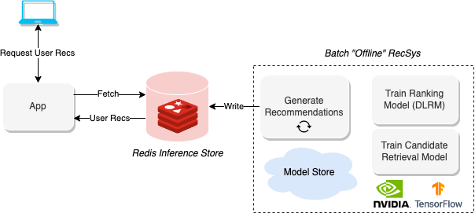

# Offline Batch Recsys

Recommendation systems are a powerful tool for businesses to personalize the user experience and increase engagement and sales. However, when dealing with large numbers of users or a high volume of data, real-time recommendations may not be feasible due to computational constraints. In such cases, offline batch recommendation systems provide a solution.



An offline batch recommendation system generates recommendations in batches, usually on a schedule or in response to a specific event. This allows for the use of more complex models and larger amounts of data, as the computational work can be done offline. 

*This could be...*
- A cron-like job that runs every few hours or days.
- A reactive job that triggers based on some event.
- A manual job that runs when you tell it to.

Once the recommendations are generated, they are stored in a low-latency key-value store such as Redis, so they can be quickly retrieved when a user requests them.

For example, a music streaming service like Spotify could generate music playlist recommendations for all users every night at 11:59pm CET.


## Running the Example

In this example, you will spin up a Merlin Tensorflow container to train a Two-Tower **Candidate Retrieval Model** with negative sampling (*fine-tuned to predict the interaction between a User and an Item in the product catalog*) and use the created embedding towers to retrieve the **topK** candidates per user. These candidates (items) will get get passed through a trained **DLRM** model to rank the candidates and write to Redis.

### Start the Container

To run the example, a Merlin Tensorflow container can be used to train the models and generate the recommendations. Docker Compose can be used to spin up the container, which may take a few minutes to pull and build the required docker containers and install Python requirements.

```bash
$ docker compose up
```
*add `-d` to this command to daemonize the docker compose stack if desired...*

> It is recommended to spin up an AWS EC2 instance with an NVIDIA GPU attached and the driver installed for the best performance. One possibility is the p3.2xlarge instance from the AWS marketplace.


